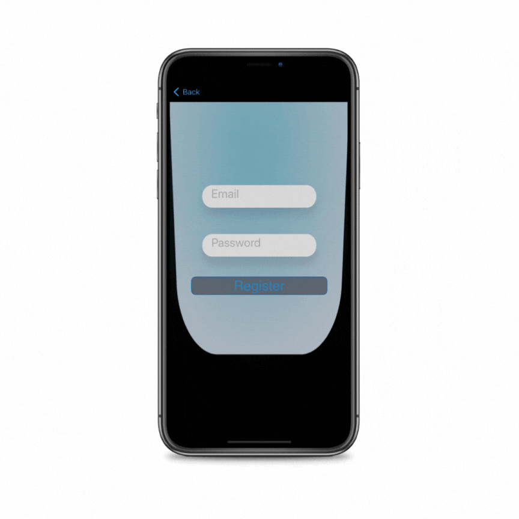

## Fiteasy

### Introduction
Fiteasy provides a solution for users to easily track and remember their training progress and weights. It eliminates the need to memorize workout details by storing them within the app. Additionally, the app allows users to execute their workout plans in the gym, providing them with a clear understanding of the exercises and the order in which they should be performed.

### Features
The app has the following features:

* Create a workout plan
* Edit a workout plan
* Follow a workout plan with timer
* Auth
  
## Dependencies
The Fiteasy app utilizes the following dependencies:

* NIO: NIO is a cross-platform asynchronous event-driven network application framework. It provides a low-level networking API for building high-performance, high-throughput systems.
  
* FirebaseAuth: FirebaseAuth is a library provided by Firebase that enables easy authentication of users in an application. It provides secure user authentication and authorization services.
  
* RealmSwift: RealmSwift is a mobile database framework that provides an alternative to traditional database solutions. It offers a simple and efficient way to store and retrieve data on mobile devices.

  
### Authentication and Training Plan Access
Fiteasy utilizes Firebase Authentication for user authentication. Users can create an account or log in using their credentials. Firebase Authentication handles the secure storage and verification of user identities.
Once a user is authenticated, Fiteasy uses the authentication token provided by Firebase to access the user's training plan. The training plan is stored and managed using RealmSwift. RealmSwift provides an easy-to-use database solution for storing and retrieving workout plans. By utilizing the authentication token, Fiteasy ensures that each user can only access and modify their own training plan.

### Running the App
To run the Fiteasy app, follow these steps:

* Clone the repository from GitHub.
* Open the project in Xcode.
* Build and run the app on your iOS device or simulator.
